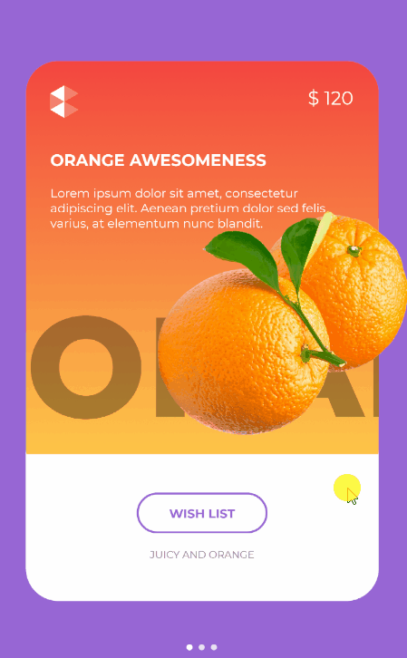
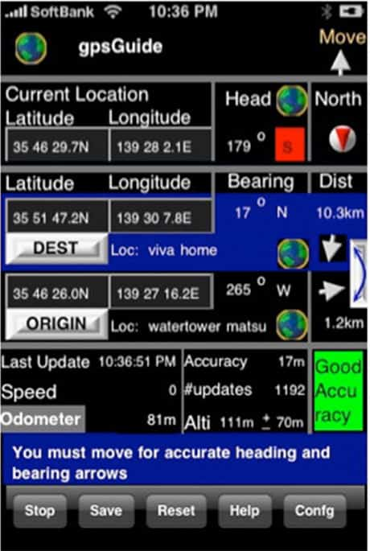
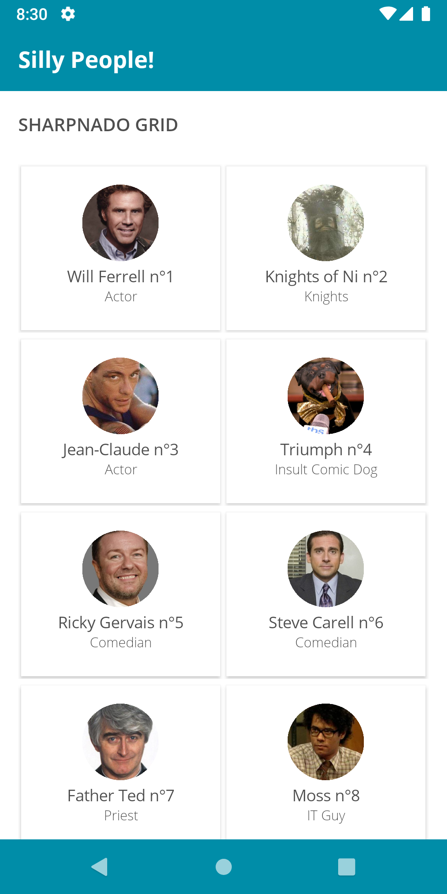
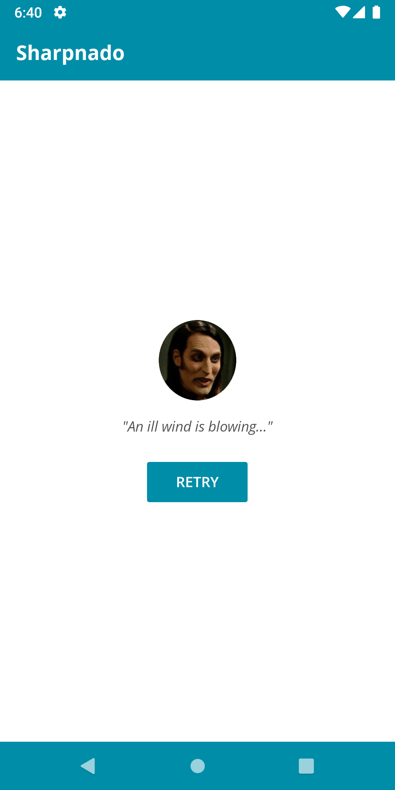

<video width="800" height="600" poster="free_yourself_banner.png" controls>
  <source src="free_yourself_from_isbusy_equals_true_v5.mp4" type="video/mp4">
</video>

Note: Hi I'm Jean-Marie and I clearly need way too much attention.

---

## [Sharpnado](https://www.sharpnado.com/)

Cause the world is a cruel place.

Look at those sweet UI created by the community:

Note: it's true, now look at that.

----

## What you won't code


Note: Javier Suárez. Wow isn't it beautiful would you want to code this? I bet you do.

----

## This


Note: Kym Phillpotts. Nice animations woooow.

----

## Or this



Note: Steven Thewissen. Sweet. You're craving to code this uh? right? Well your designer has other plans for you kiddo!

----

## But this!



Note: eat this!

----

## [Sharpnado](https://www.sharpnado.com/)

Pragmatic components for the sad real world:

* HorizontalListView
* Tabs
* SkiaSharp curves and gradient overlays on Google Maps
* Stupid monty python based jokes

Note: now you could ask yourself "what the hell am I doing here?" ok.

----

## Consulting services

* Create a solution architecture for a new project
* Lead your team on concrete issues
* Create Xamarin.Forms application from scratch (design included :)
* Help with performance issues or maintainability

---

## What is it about

* Composition vs Inheritance
* Async loading practices
* View model loading states
* Task as a loading state component

Note: enough with the silliness.

---

<!-- .slide: class="stretch" -->

## Our silly people view

<div class="container">
    <div class="left">
        
    </div>
    <div class="right">
<pre><code class="xml">&lt;Grid&gt;
    &lt;GridView x:Name=&quot;OurResultView&quot;
        ItemsSource="{Binding SillyDudes}" /&gt;
&lt;/Grid&gt;
</code></pre>
    </div>
</div>

----

[//]: # (<!-- .slide: class="stretch" -->)

## Silly people view model

```csharp
public ObservableCollection<SillyDudeVmo> SillyDudes { get; private set; }

public async void Initialize()
{
    await LoadSillyPeopleAsync();
}

public Task LoadSillyPeopleAsync()
{
    SillyDudes = new ObservableCollection<SillyDudeVmo>(
        (await _sillyDudeService.GetSillyPeople())
            .Select(dude => new SillyDudeVmo(dude)));
    RaisePropertyChanged(nameof(SillyDudes));
}
```

Note: So, here is our shameless initialization code (spoiler alert: this is wrong).

----

## Loading

<div class="container">
    <div class="left">
        
    </div>
    <div class="right">
<pre><code class="xml">&lt;Grid&gt;
    &lt;GridView x:Name=&quot;OurResultView&quot; 
        ItemsSource="{Binding SillyDudes}"
        IsVisible="{Binding IsBusy, 
            Converter={StaticResource 
                BoolInverterConverter}}" /&gt;
    &lt;ActivityIndicator IsRunning="{Binding IsBusy}" /&gt;
&lt;/Grid&gt;
</code></pre>
    </div>
</div>

----

## Silly people view model

```csharp
public async void Initialize()
{    
    IsBusy = true;
    try
    {
        await LoadSillyPeopleAsync();
    }
    finally
    {
        IsBusy = false;
    }
}

```

Note: This is a little better, but wait, I want to give a UI feedback to the user. Now if a exception occurs here, it will silently fail and you end up with a dirty UI state: no error but no success.

----

## Error handling

<!-- .slide: id="naive-error" -->

<div class="container">
    <div class="left">
        
    </div>
    <div class="right">
<pre><code class="xml">&lt;Grid&gt;
    &lt;GridView x:Name=&quot;OurResultView&quot; 
        ItemsSource="{Binding SillyDudes}"
        IsVisible="{Binding IsBusy, 
            Converter={StaticResource 
                BoolInverterConverter}}" /&gt;
    &lt;ActivityIndicator IsRunning="{Binding IsBusy}" /&gt;
    &lt;ErrorView IsVisible="{Binding HasErrors}"
        Text="{Binding ErrorMessage}" /&gt;
&lt;/Grid&gt;
</code></pre>
    </div>
</div>

----

<!-- .slide: id="naive-error-vm" -->

```csharp
public ObservableCollection<SillyDudeVmo> SillyDudes { get; private set; }

public async void Initialize()
{
    IsBusy = true;
    HasErrors = false;
    try    
    {            
        await LoadSillyPeopleAsync();
    }
    catch (Exception exception)
    {
        HasErrors = true;
        ErrorMessage = exception.ToErrorMessage();
    }
    finally
    {
        IsBusy = false;
    }
}

public Task LoadSillyPeopleAsync()
{ ... }
```

---

## Code reuse

**EASY** Put it in abstract `ViewModelBase`!
 
But... all VM doesn't require async loading...

**EASY** Create another hierarchy level!!

----


```csharp
public abstract class ViewModelLoadable : ViewModelBase
{
    public async void Initialize()
    {
        IsBusy = true;
        HasErrors = false;
        try    
        {            
            await InitializeAsync();
        }
        catch (Exception exception)
        {
            HasErrors = true;
            ErrorMessage = exception.ToErrorMessage();
        }
        finally
        {
            IsBusy = false;
        }
    }

    protected abstract Task InitializeAsync();
}
```

----

## And so on...

Mmmh but wait... The way we are dealing with lists is different than with simple item... 

```
ViewModelBase
    | 
    |__ViewModelLoadable
            |
            |__ViewModelLoadableItem


ViewModelBase
    | 
    |__ViewModelLoadable
            |
            |__ViewModelLoadableList
```


Note: Now you're in the inheritance maze, you will think you reuse all your code with inheritance, and you will go crazy... You can think I exaggerating a bit. So now I'm gonna show you a real world example I stumbled upon.

----

## Real world example

```
MvxViewModel
    | 
    |__AbstractViewModel
            | 
            |__ObjectViewModel<T>
                    | 
                    |__AdvertisementBaseViewModel<T>
                            | 
                            |__AdvertisementResultViewModel
                                    | 
                                    |__AdvertisementFavoriteViewModel
```

Note: issues induced: debugging is really hard. Your VM states and properties are 

----

# Issues

* Debugging is really hard
* Your VM states and properties are scattered all around: you are losing control
* Modifying mother classes will possibly break all the children classes
* What is exactly the responsability of each of these classes?

----

## STOP IT

Ok stop it, stop that nonsense.

Just use Composition over Inheritance.

---

## Composition vs inheritance

Make a component out of:

```csharp
IsBusy = true;
HasErrors = false;
try    
{            
    await InitializeAsync();
}
catch (Exception exception)
{
    HasErrors = true;
    ErrorMessage = exception.ToErrorMessage();
}
finally
{
    IsBusy = false;
}
```

----

## Create a component

Start with SRP (single responsibility principle)

* What is the role of the View Model?
* What is the role of the component?

----

## Loading component 

1. Load an async method
2. Get the state of the loading (`success/fail/not_completed`)
3. Can return a result (item or list whatever)
4. `NotifyPropertyChanged` for state-oriented properties

1, 2 & 3 = [C# `Task`](https://docs.microsoft.com/en-US/dotnet/api/system.threading.tasks.task?view=netstandard-2.1#properties)

Note: since async/await people tend to underestimate the power of the Task object. But it has all the informations you need to manage your VM states.

---

## NotifyTask

We need a wrapper around the `Task` object implementing `INotifyPropertyChanged`: 

[`NotifyTask`](https://github.com/StephenCleary/Mvvm.Async/blob/master/src/Nito.Mvvm.Async/NotifyTask.cs)

This component has been created by [Stephen Cleary years ago](https://msdn.microsoft.com/en-us/magazine/dn605875.aspx)

----

## Our views

<table>
  <tr>
    <th></th>
    <th></th>
    <th></th>
  </tr>
</table>

----

```csharp
public NotifyTask<ObservableCollection<SillyDudeVmo>> SillyDudesTask 
{ 
    get; 
    private set; 
}

public void Initialize()
{
    SillyDudesTask = NotifyTask<ObservableCollection<SillyDudeVmo>>
        .Create(LoadSillyPeopleAsync());
    RaisePropertyChanged(SillyDudesTask);
}

public Task LoadSillyPeopleAsync()
{
    return new ObservableCollection<SillyDudeVmo>(
        (await _sillyDudeService.GetSillyPeople())
            .Select(dude => new SillyDudeVmo(dude)));
}
```

[Remember](#/naive-error-vm)

Note: async void is gone!

----

## View side

<!-- .slide: id="notifytask-view" -->

<pre><code class="xml">&lt;Grid BindingContext="{Binding SillyDudesTask}"&gt;
    &lt;GridView x:Name=&quot;OurResultView&quot; 
        ItemsSource="{Binding Result}"
        IsVisible="{Binding IsSuccessfullyCompleted}" /&gt;
    &lt;ActivityIndicator IsRunning="{Binding IsNotCompleted}" /&gt;
    &lt;ErrorView IsVisible="{Binding IsFaulted}"
        Text="{Binding InnerException,
            Converter={StaticResource 
                ExceptionToErrorMessage}}" /&gt;
&lt;/Grid&gt;
</code></pre>

[Remember](#/naive-error)

----

## But what do we want really?

* Something more view model oriented
* A component handling all common loading states
  
---

## [View Model Loader](https://github.com/roubachof/Sharpnado.Presentation.Forms/blob/master/Sharpnado.Presentation.Forms/ViewModels/ViewModelLoader.cs)

A specialization of `NotifyTask`, handles:

1. Loading
2. Success
3. Empty state
4. Error (and all sub exceptions with a ErrorHandler: `Func<Exception, string>`)
5. Refresh

Note: So instead of giving to a parent view model the responsibility to handle all these for us, we just create a reusable component to do so, achieving a clearer architecture. Naming is super important.

----

## Special raisable properties


```csharp
public bool ShowLoader

public bool ShowRefresher

public bool ShowResult

public bool ShowError

public bool ShowEmptyState

public bool ShowErrorNotification

public string ErrorMessage

public Exception Error

public string EmptyStateMessage
```

Note: show ViewModelLoader code

----

```csharp
public ViewModelLoader<ObservableCollection<SillyDudeVmo>> 
    SillyPeopleLoader { get; }

public void Initialize()
{
    SillyPeopleLoader.Load(LoadSillyPeopleAsync);
}

public Task LoadSillyPeopleAsync()
{
    return new ObservableCollection<SillyDudeVmo>(
        (await _sillyDudeService.GetSillyPeople())
            .Select(dude => new SillyDudeVmo(dude)));
}
```

Note: The viewmodelloader is instantiated in the VM constructor. So it doesn't have to be raised. From the vm point of view it is very close to the NotifyTask, but it will greatly simplify the way we give UI feedback to the user. We will not use it directly to the view, but we'll bind it to a custom view...

---

## [The Task Loader View](https://github.com/roubachof/Sharpnado.Presentation.Forms/blob/master/Sharpnado.Presentation.Forms/CustomViews/TaskLoaderView.xaml)

A container switching between views matching the view model state.

It is the natural brother of the `ViewModelLoader`: you bind a `ViewModelLoader` to a `TaskLoaderView`.


Note: show TaskLoaderView XAML code, then code-behind

----

## Our example

```xml
<customViews:TaskLoaderView Style="{StaticResource SillyTaskLoader}"
                            ViewModelLoader="{Binding SillyPeopleLoader}">
    <GridView x:Name="OurResultView"; 
        ItemsSource="{Binding SillyPeopleLoader.Result}">
</customViews:TaskLoaderView>
```

[Remember](#/notifytask-view)

----

## Stylable

```xml
<Style x:Key="SillyTaskLoader" TargetType="customViews:TaskLoaderView">
    <Setter Property="AccentColor" 
        Value="{StaticResource Accent}" />
    <Setter Property="FontFamily" 
        Value="{StaticResource FontItalic}" />
    <Setter Property="EmptyStateImageUrl" 
        Value="dougal.png" />
    <Setter Property="RetryButtonText" 
        Value="{localization:Translate ErrorButton_Retry}" />
    <Setter Property="TextColor" 
        Value="{StaticResource TextPrimaryColor}" />
    <Setter Property="ErrorImageConverter" 
        Value="{StaticResource ExceptionToImageSourceConverter}" />
</Style>
```

---

# Demo

* [SillyPeopleVm.cs](https://github.com/roubachof/Xamarin-Forms-Practices/blob/free-yourself/SillyCompany.Mobile.Practices/Presentation/ViewModels/SillyPeopleVm.cs)
* [SillyPeoplePage.xaml](https://github.com/roubachof/Xamarin-Forms-Practices/blob/free-yourself/SillyCompany.Mobile.Practices/Presentation/Views/SillyPeoplePage.xaml)

Note: don't forget: ErrorHandler and ExceptionToImageSourceConverter

---

## Composition

* You use a component when you need it
* You can compose components
* It makes you think a lot more about SRP

---

## What's next?

* Refactoring of `NotifyTask` and `ViewModelLoader`
* Improved and more customizable `TaskLoaderView`
* Secret project

https://www.sharpnado.com/taskloaderview-async-init-made-easy/
https://www.sharpnado.com/paginator-platform-independent/

---

#  Thanks! Questions?

* @Piskariov
* jm@sharpnado.com
* www.sharpnado.com
* github.com/roubachof